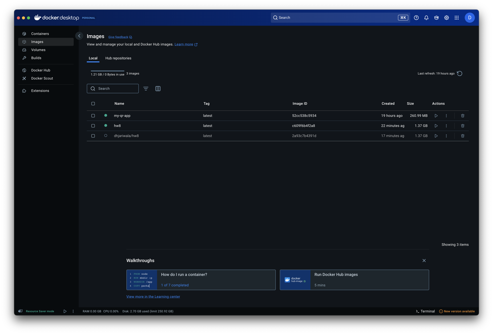
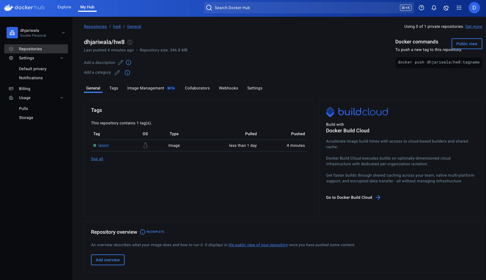

# IS601 - HW8
This repository contains basic structure for uploading image to docker and using github actions to update docker everytime the codebase is updated.

This is part of course IS601.

## Requirements
1. ✅ Put the screenshot of your image in your Docker account here. 
Below image is from Docker Desktop images tab. As seen from the image, I have `dhjariwala/hw8`, which is the image of this code base.

Below image is the Docker Hub Repository that was created.

✅ Github Actions Pass (pytest)
✅ build-and-push docker Pass 